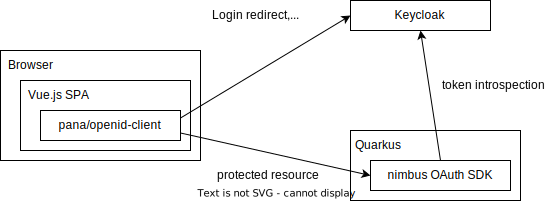
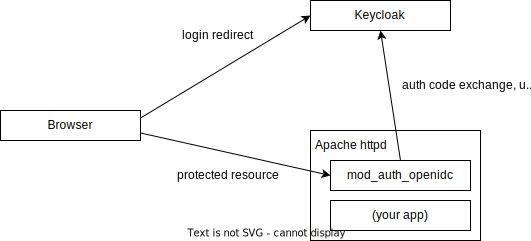

= DPoP Demos

This is a demo showing some proof-of-concepts with readily available DPoP implementations.

DPoP is an acronym for "`OAuth 2.0 Demonstrating Proof-of-Possession`" and it is defined in https://datatracker.ietf.org/doc/html/rfc9449[RFC9449].

This repository accompanies the FOSDEM 2025 talk https://fosdem.org/2025/schedule/event/fosdem-2025-5370-using-dpop-to-use-access-tokens-securely-in-your-single-page-applications/[Using DPoP to use access tokens securely in your Single Page Applications].

== What you can see here

This allows you to tinker with the following setups:

* Using DPoP from a single page app (SPA)
+

* Using DPoP with an application in Apache httpd
+

Each sub-folder contains a README.adoc on how to run each of the components.

== Prerequisites

* Java
* Podman
* Container networking mode "`host`" (only works on Linux)

